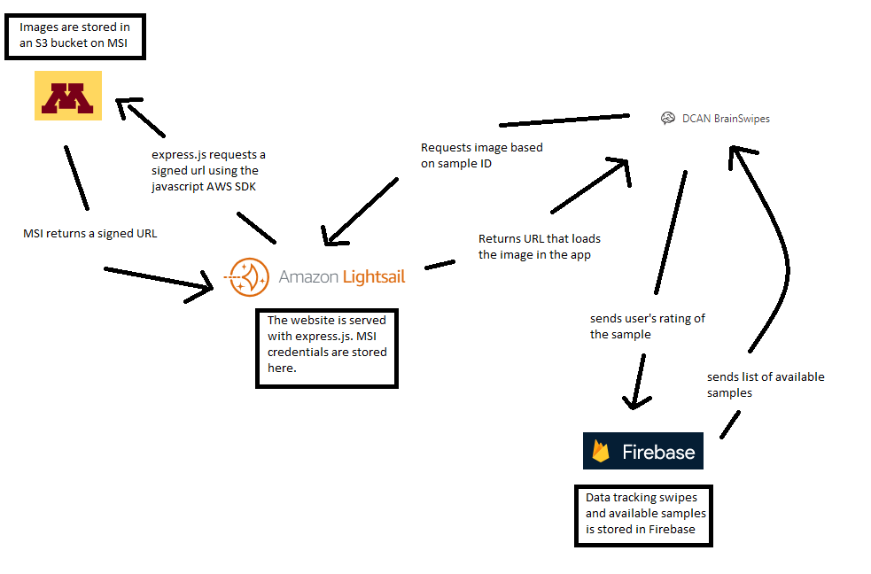

# BrainSwipes
[BrainSwipes](https://brainswipes.us) is a web application that brings the swipe right, swipe left paradigm to quality assurance.

The DCAN Labs handle many neuroimaging datasets, and BrainSwipes helps centralize and scale the process of ensureing quality data.

BrainSwipes is built off of the open source [Swipes For Science](https://docs.swipesforscience.org/) platform.


## BrainSwipes Architecture
BrainSwipes is hosted on [AWS Lightsail](https://lightsail.aws.amazon.com/ls/webapp/home/instances?#), uses a [Firebase](https://console.firebase.google.com/project/brainswipes/overview) database to track data on swipes, and S3 storage on UMN's [Minnesota Supercomputing Institute (MSI)](https://www.msi.umn.edu/).



## Setup for Development
All development should be done on a branch on your local machine. Do not push to main until development is complete.
Install node v17.2.0 and npm v8.1.4 (version compatibility is critical). It is recommended to use nvm for installation.
```
git clone git@github.com:DCAN-Labs/SwipesForScience.git
cd SwipesForScience
npm install
npm run dev
```
​​Your application is running here: http://localhost:8080  

The database uses [firebase appcheck](https://firebase.google.com/docs/app-check/web/recaptcha-provider) to protect the app. You may need to add a token or temporarily enable localhost.

## Deployment
To build the files for use with a http server, use the command npm run build in the SwipesForScience folder on your local machine. These files will appear in the /dist directory. Use git checkout lightsail and replace the files in /public with the new files from /dist. To test the build locally use node express.js in the directory with the file express.js. Your app will be running on http://localhost:3000

The server running the live version of this is an instance of Amazon Linux 2 on AWS Lightsail. Contact [Barry Tikalsky](mailto:tikal004@umn.edu) for access. 
Push the built files to the origin. On the lightsail instance, open the console.  cd SwipesForScience and git pull . You will need to use your github credentials to pull.
If you modify the express.js file you will need to install any new packages you use with npm on the Lightsail instance.
To restart the server using the new files, run pm2 kill then pm2 start express.js . Your new version should now be running on brainswipes.us


## Adding new images
Use the tools/es2sfs_img_converter.py script to format images for use with brainswipes

[Adding new studies to BrainSwipes](https://docs.google.com/document/d/1apA6hc4Oj33BoP_t7oacL-x3vDvglYWSt0CdlycPeuM/edit?usp=sharing)

## Data Storage
The images are in AWS S3 buckets hosted on MSI. To find the name of the bucket, look in firebase under config/studies/[study name]/bucket. This is accessed in a node.js server on AWS Lightsail using the [AWS SDK](https://docs.aws.amazon.com/sdk-for-javascript/v2/developer-guide/welcome.html). The SDK uses a service account’s MSI credentials to construct a URL that gives limited access to an image. If the MSI credentials are accidentally revealed you can renew them on [MSI’s website](https://www.msi.umn.edu/content/s3-credentials) then update them on the server.

The app uses [Firebase](https://console.firebase.google.com/project/brainswipes/overview) to store information on how images have been rated. Contact [Barry Tikalsky](mailto:tikal004@umn.edu) for access.

## Domain Name
This site is hosted on http://brainswipes.us this domain is managed on AWS Route 53 under the account tied to the [DCAN Labs email](mailto:dcanlabs@umn.edu)