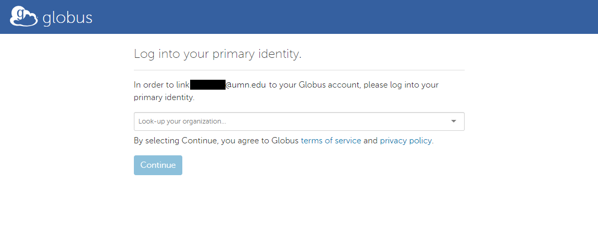

# Initializing Globus Access

*You do not need a Globus account to start this process.*
*Your Globus account will be created automatically when you first attempt to log in.*

1. BrainSwipes will prompt you to log in with Globus

1. Select the organization you are registered with for the data use agreement for the study you are requesting access to.

1. You will be prompted to log in to your organization's system as if you were accessing their resources.

1. If this is the first time you have accessed Globus with this organization you will be prompted to continue with a new Globus account or link to an existing one. If you have never used Globus before, click continue. If you have accessed Globus with a different identity, click Link to an existing account.

1. If you clicked Continue on the previous step you will be forwarded to the Globus consent page. Accept and continue. Skip to step 7.

1. If you clicked `Link to an existing account` in step 4 you will be asked to log into your primary identity. This will have you repeat steps 2-3 for your existing identity.

1. You are now logged in to Globus. The BrainSwipes application will ask to see your identity details in the Globus interface. Provide a name for your device and click Allow.

