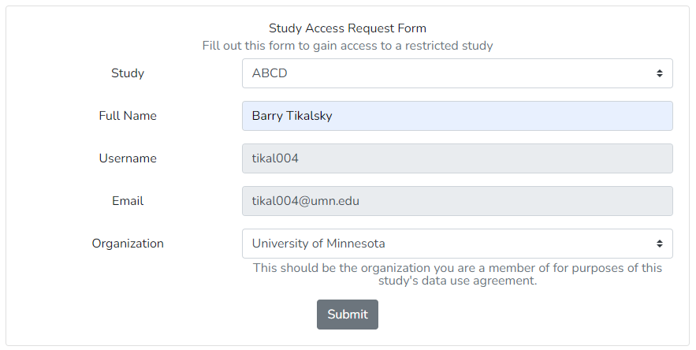
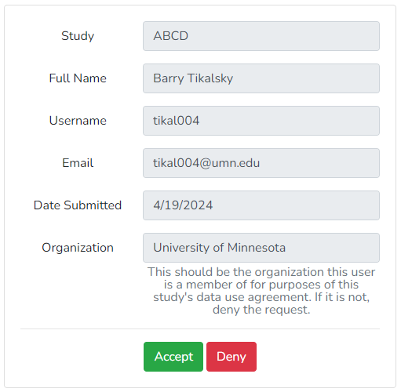

# Access Requests

Studies with limited access require users to request access and study admin to approve requests.

## User Requests
If a user does not have access to a study they can fill out an access request form. This form can be accessed in three ways.

1. From the Home page. Users can click on gray buttons to be forwarded to the about page for that study. The about page links to the access request form.

1. From the About page. Users can select a study at the bottom of the about page. Each study's about page links to the access request form.

1. From the Profile page. Users will see the status of their study access in their profile. A link to the access request form is shown below their current study access.

Here is an example of the access request form

In order to fill out this form a user must log in with Globus.
BrainSwipes will automatically fill out the `Username` and `Email` fields. 
The `Organization` field is a dropdown that is populated by Globus.

In order to gain access a user must select the organization from the dropdown that matches the organization the user has signed a data use agreement for.
If this organization does not appear the user will likely have to [link it their primary identity in Globus](https://docs.globus.org/guides/tutorials/manage-identities/link-to-existing/).

## Reviewing Requests

Study admins will be able to view the current requests for access in the admin route under `Review Access Requests`. 

Here is an example of an access request

It is an admin's duty to ensure that the user who has requested access is legally allowed to see the study.
It is important that the organization selected matches the organization the user is part of on any data agreements. 
Globus requires a recent login from that organization which helps maintain updated authorization.

Upon accepting or denying a request, a formatted email can be sent by clicking 'Send Email'.
This will open in your default email service.
This is not required but we encourage communicating with users about the status of their requests.